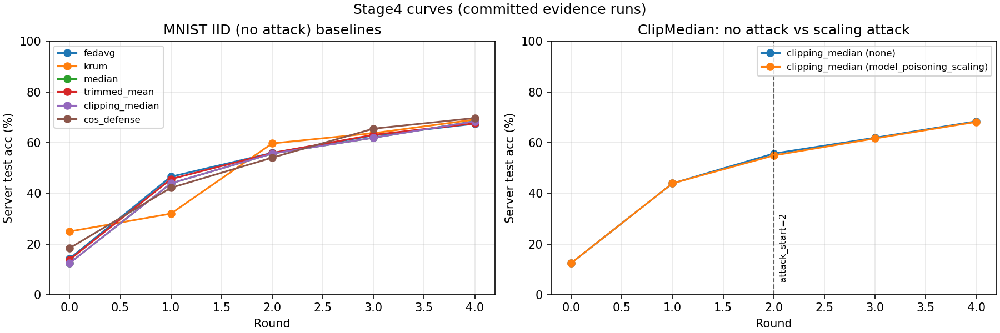
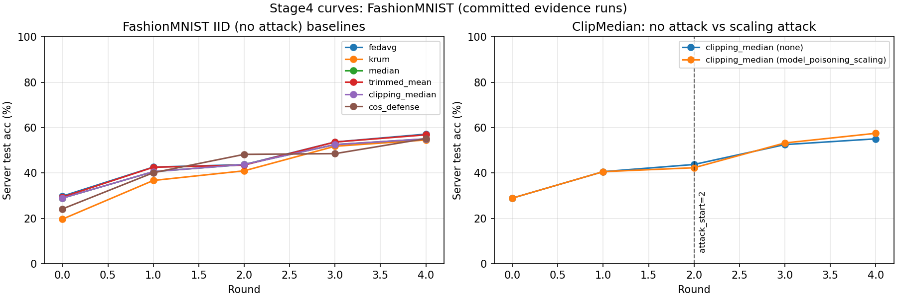
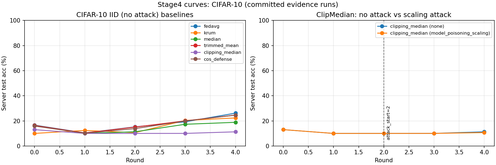

# Quick Look

This file is a fast way to browse the *committed* evidence runs and their key metrics.

## Stage4 results (MNIST, IID, seed=7890, rounds=5, local_epochs=1)

Notes:
- `test_acc` is reported in percent (0-100).
- Values are read from `results/<run_id>/artifacts/summary.json`.
- Same metrics definitions apply to all datasets below.

| run_id | aggregator | attack | final_test_acc | best_test_acc | min_test_acc_after_attack |
| --- | --- | --- | ---: | ---: | ---: |
| `stage4_mnist_noattack_fedavg` | `fedavg` | `none` | 67.42 | 67.42 |  |
| `stage4_mnist_noattack_krum` | `krum` | `none` | 69.06 | 69.06 |  |
| `stage4_mnist_noattack_median` | `median` | `none` | 68.43 | 68.43 |  |
| `stage4_mnist_noattack_trimmedmean` | `trimmed_mean` | `none` | 67.57 | 67.57 |  |
| `stage4_mnist_noattack_clipmedian` | `clipping_median` | `none` | 68.39 | 68.39 |  |
| `stage4_mnist_noattack_cosdefense` | `cos_defense` | `none` | 69.68 | 69.68 |  |
| `stage4_mnist_scaling_clipmedian` | `clipping_median` | `model_poisoning_scaling` | 68.16 | 68.16 | 54.92 |



## Stage4 results (FMNIST, IID, seed=7890, rounds=5, local_epochs=1)

| run_id | aggregator | attack | final_test_acc | best_test_acc | min_test_acc_after_attack |
| --- | --- | --- | ---: | ---: | ---: |
| `stage4_fmnist_noattack_fedavg` | `fedavg` | `none` | 57.10 | 57.10 |  |
| `stage4_fmnist_noattack_krum` | `krum` | `none` | 54.53 | 54.53 |  |
| `stage4_fmnist_noattack_median` | `median` | `none` | 55.01 | 55.01 |  |
| `stage4_fmnist_noattack_trimmedmean` | `trimmed_mean` | `none` | 56.81 | 56.81 |  |
| `stage4_fmnist_noattack_clipmedian` | `clipping_median` | `none` | 55.04 | 55.04 |  |
| `stage4_fmnist_noattack_cosdefense` | `cos_defense` | `none` | 55.13 | 55.13 |  |
| `stage4_fmnist_scaling_clipmedian` | `clipping_median` | `model_poisoning_scaling` | 57.48 | 57.48 | 42.29 |



## Stage4 results (CIFAR10, IID, seed=7890, rounds=5, local_epochs=1)

| run_id | aggregator | attack | final_test_acc | best_test_acc | min_test_acc_after_attack |
| --- | --- | --- | ---: | ---: | ---: |
| `stage4_cifar10_noattack_fedavg_v2` | `fedavg` | `none` | 26.15 | 26.15 |  |
| `stage4_cifar10_noattack_krum` | `krum` | `none` | 22.33 | 22.33 |  |
| `stage4_cifar10_noattack_median` | `median` | `none` | 18.84 | 18.84 |  |
| `stage4_cifar10_noattack_trimmedmean` | `trimmed_mean` | `none` | 24.60 | 24.60 |  |
| `stage4_cifar10_noattack_clipmedian` | `clipping_median` | `none` | 11.27 | 13.01 |  |
| `stage4_cifar10_noattack_cosdefense` | `cos_defense` | `none` | 24.60 | 24.60 |  |
| `stage4_cifar10_scaling_clipmedian` | `clipping_median` | `model_poisoning_scaling` | 10.67 | 13.01 | 10.00 |



## Stage4 results (TinyImageNet, IID, seed=7890, rounds=5, local_epochs=1)

| run_id | aggregator | attack | final_test_acc | best_test_acc | min_test_acc_after_attack |
| --- | --- | --- | ---: | ---: | ---: |
| `stage4_tinyimagenet_noattack_fedavg` | `fedavg` | `none` | 3.52 | 3.52 |  |
| `stage4_tinyimagenet_noattack_krum` | `krum` | `none` | 1.88 | 1.88 |  |
| `stage4_tinyimagenet_noattack_median` | `median` | `none` | 2.95 | 3.38 |  |
| `stage4_tinyimagenet_noattack_trimmedmean` | `trimmed_mean` | `none` | 3.65 | 3.65 |  |
| `stage4_tinyimagenet_noattack_clipmedian` | `clipping_median` | `none` | 0.62 | 0.66 |  |
| `stage4_tinyimagenet_noattack_cosdefense` | `cos_defense` | `none` | 2.70 | 2.90 |  |
| `stage4_tinyimagenet_scaling_clipmedian` | `clipping_median` | `model_poisoning_scaling` | 0.74 | 0.74 | 0.48 |


## Plot regeneration

From `magma_experiment/`:

```bash
python scripts/plot_stage4_curves.py --dataset mnist
python scripts/plot_stage4_curves.py --dataset fmnist
python scripts/plot_stage4_curves.py --dataset cifar10
python scripts/plot_stage4_curves.py --dataset tinyimagenet
```
